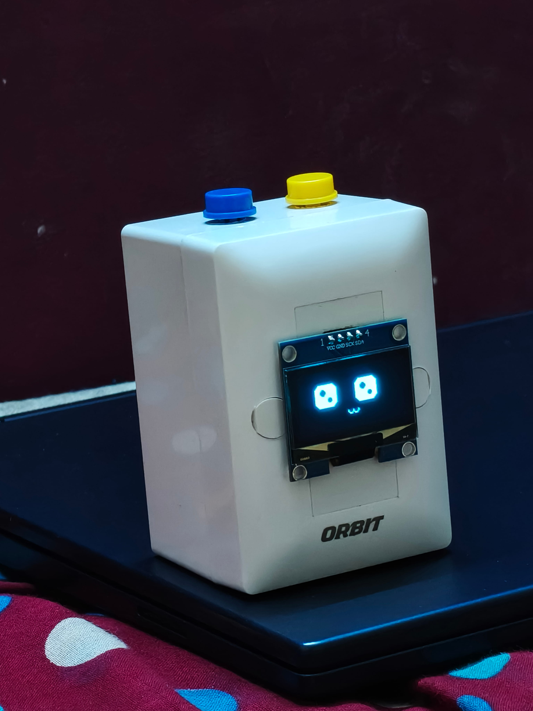
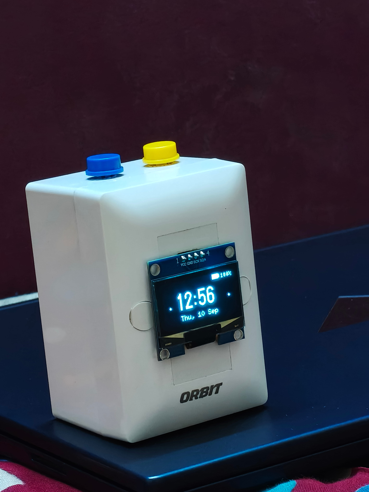
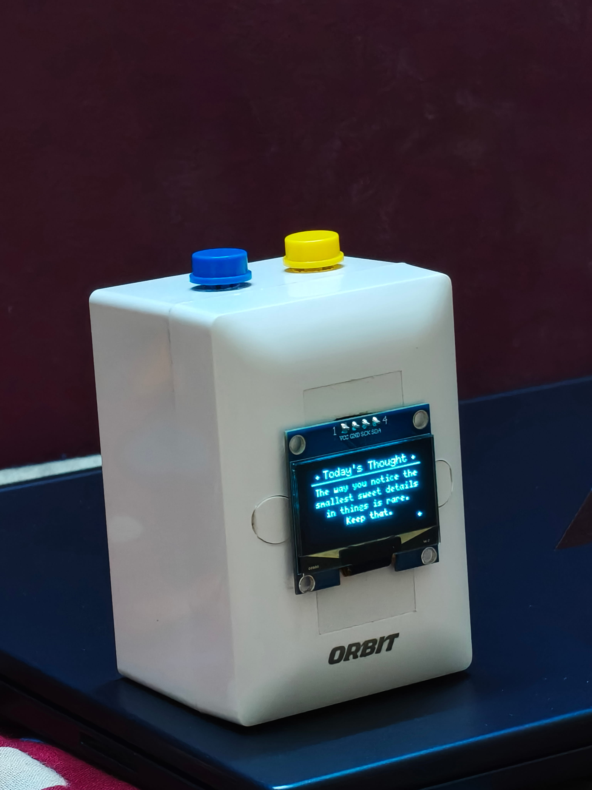

# Aurora — Animated OLED Deskmate

> Hand-built **ESP32-C3 birthday gift firmware**: a living, breathing OLED desk pet that blinks, smiles, remembers every touch, and gently reminds you of the daily message at midnight. Everything runs on-device via a private WiFi hotspot and a LittleFS-served mobile dashboard — no cloud, no accounts.

**Version:** `0.5.1` · **Board:** ESP32-C3 (DevKitM-1 / Supermini) · **Framework:** Arduino (PlatformIO)

---

## Overview & Story

Aurora is a small hand-built desk companion and the firmware behind a one-of-a-kind birthday gift. Where a typical gadget shows technical numbers (AP stats, raw millivolts, counter readouts), Aurora replaces them with something softer: a living animated character with expressive eyes, a mood that responds to love and loneliness, a breathing light that syncs with her feelings, and a time-gated midnight moment.

Two firmware blocks are merged into a single image:

- **Block 1 — Deskmate Engine:** the animated OLED character, touch input, mood-synced LED breathing, and battery care.
- **Block 4 — Dashboard & SoftAP:** a private WiFi hotspot (`Aurora`) that serves a mobile dashboard of daily messages, keepsake letters, and a music box.

The design intent is deliberately non-technical on the OLED: all metrics and statistics stay hidden from the display and are only reachable via the web dashboard at `192.168.4.1`, preserving a calm, romantic companion experience.

## Features at a Glance

  
  

**The Deskmate** — Aurora's living face on the OLED: blinking, smiling, and watching over the desk.

**Clock & Date** — one button press cycles to a large digital clock with a contextual greeting.

  
  

**Daily Thoughts** — today's rotating supportive message, one of 30.

**The Gift** — the hand-built device, ready to sit on a desk.

> **Private live preview:** open the rendered dashboard page any time at this
> link — [gist.github.com/asifahamed-ece/ee9221cd46752af818e399eaa905c4b6](https://gist.github.com/asifahamed-ece/ee9221cd46752af818e399eaa905c4b6)
> (secret gist: `README.md` renders, `aurora-dashboard.html` is the full offline self-contained dashboard).

## Features & Capabilities

### Living Deskmate (`DeskmateMood`)

| Mood | Trigger | Behaviour |
|---|---|---|
| `IDLE_NORMAL` | default | Organic blinking, eye gaze saccades, soft smile |
| `HAPPY` | mode context | Bouncy arched eyes, blushing cheeks |
| `LOVE_TOUCHED` | any touch (button **or** dashboard) | Beating heart eyes, floating hearts, blushing, romantic reaction |
| `LONELY_SAD` | no touch for 1 hour | Droopy eyes, quivering mouth, sliding teardrop |
| `MIDNIGHT_REMINDER` | 00:00 | Animated envelope, sparkles, daily-message prompt |
| `SLEEPING` | late-night rest | Curved sleeping eyes, drifting `z Z Z` |

### Screen Modes (cycled by short-pressing the mode button)

| Mode | Shows |
|---|---|
| `DESKMATE` | The animated living character (default) |
| `CLOCK_DATE` | Large digital clock + contextual greeting + date |
| `DAILY_QUOTE` | Today's rotating daily thought |
| `QR_CODE` | WiFi-join QR — scan to connect to the hotspot |
| `QR_DASHBOARD` | Dashboard QR — scan to open `192.168.4.1` |
| `HEARTBEAT_KEEPSAKE` | Pulsing heart + travelling ECG pulse + lifetime Warm Touches |

### Input & Attention

- **Warm Touch button (GPIO0):** pets the deskmate, triggers the heart-eyes happy reaction, and increments a persisted keepsake counter (stored in NVS so it survives reboots).
- **Mode / WiFi button (GPIO2):** short press cycles screen modes; a 3-second hold toggles the WiFi hotspot.
- **Neglect system:** 1 hour without a Warm Touch transitions Aurora to the lonely/sad state, asking to be touched again.
- **Mood-synced breathing LED:** breathing period follows mood — 800 ms excited heartbeat, 1500 ms normal, 3200 ms lonely sigh.

### Battery Care

- ADC on a 100 kΩ/100 kΩ voltage divider (GPIO3), averaged sampling.
- Thresholds: `OK` > 3.5 V · `LOW` < 3.4 V ("Battery Hungry") · `CRITICAL` < 3.1 V ("Please Charge Me") · boot-block below 2.8 V.

### Midnight Reminder

At exactly 12:00 AM the deskmate switches to an animated love-envelope scene and prompts you to check the phone dashboard for the day's message. It fires once per day (day-of-year acknowledgement persisted in NVS).

### Web Dashboard & Connectivity

- Private softAP `Aurora` (`192.168.4.1`) over AsyncWebServer + AsyncWebSocket + LittleFS.
- Real-time bidirectional sync: touches made from the dashboard trigger the exact same excited heart-eyes reaction on the physical OLED.
- Modern CSS/JS dashboard with an optional scanning QR code for entry.

## Web Dashboard Guide

### Connect

1. On your phone, join the WiFi hotspot **`Aurora`** (password **`for-chandni`**) — the captive portal redirects silently, no "sign in" page needed.
2. Open **`http://192.168.4.1/`** in any browser (or scan the on-screen QR code).
3. While connected, touches you send from the dashboard are mirrored live on the physical deskmate.

### Dashboard tabs

- **Today** — greeting, live time, today's daily message, mood, battery, touch stats.
- **Letters** — keepsake envelope jar of short personal letters (incl. "Open when you can't sleep at 2 AM").
- **Dreamland** — a resting photo card, a quiet note, and an integrated **Music Box** playing a gentle Brahms-lullaby music-box arrangement (Web Audio, generated on-device in the browser).

Birthday mode is detected from the clock and celebrated automatically.

### API & WebSocket endpoints

| Endpoint | Purpose |
|---|---|
| `GET /api/state` | JSON snapshot for first paint (time, message, stats, battery, network) |
| `GET /version` | Firmware version string |
| `WS /ws` | Push socket — state broadcast every ~2 s, `hello` frame on connect, ping/pong |
| `GET /update`, `POST /update` | Web OTA firmware reflash (only while hotspot is active) |
| `POST /upload` | LittleFS filesystem upload (OTA of dashboard assets) |
| `GET /generate_204`, `/hotspot-detect.html`, … | Silent captive-portal detection endpoints |
| fallback / `onNotFound` | Unknown routes serve the dashboard (captive-portal "login" landing) |

All time, messages, letters, and touch history are stored **on-device only** (LittleFS + NVS) — nothing leaves the hotspot.

## Related Docs

| Doc | What it covers |
|---|---|
| [`docs/PIN_DIAGRAM.md`](docs/PIN_DIAGRAM.md) | Full wiring, strapping-pin warnings, breadboard layout, hardware checklist |
| [`docs/USER_MANUAL.md`](docs/USER_MANUAL.md) | Recipient-friendly manual (also rendered as a print-ready card) |
| [`2026-09-05-aurora-gift-design.md`](2026-09-05-aurora-gift-design.md) | Original design spec (concept, tone, timeline, enclosure) |
| [`feasibility-analysis.md`](feasibility-analysis.md) | Deep technical feasibility pass (pins, memory budget, libraries) |
| [`IMPLEMENTATION_PROGRESS.md`](IMPLEMENTATION_PROGRESS.md) | Build status, subsystem verification, change log |
| `data/` | LittleFS dashboard sources (`index.html`, `app.js`, `messages.js`, …) |
| `lib/ESPAsyncWebServer-patched/` | Vendored AsyncWebServer with RISC-V heap-corruption fix |